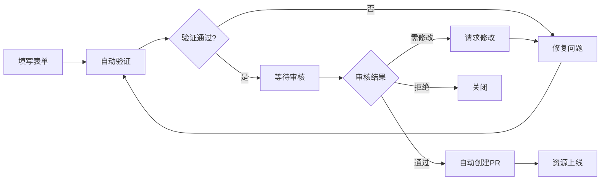

# Awesome Claude Code 入门学习指南

欢迎来到 Awesome Claude Code！这是一份完整的入门指南，帮助你快速了解和使用这个资源集合。

## 📚 目录

- [项目简介](#项目简介)
- [快速开始](#快速开始)
- [资源分类详解](#资源分类详解)
- [如何浏览资源](#如何浏览资源)
- [如何贡献资源](#如何贡献资源)
- [项目结构](#项目结构)
- [常见问题](#常见问题)
- [进阶学习](#进阶学习)

---

## 项目简介

### 什么是 Awesome Claude Code？

Awesome Claude Code 是一个精心策划的资源列表，收集了与 **Claude Code**（Anthropic 开发的 AI 编程助手）相关的各种工具、技能、工作流和配置。

### 项目特点

- ✨ **精选资源**：每个资源都经过人工审核，确保质量和实用性
- 🔄 **自动化管理**：使用自动化系统管理资源提交、验证和更新
- 📊 **多种视图**：提供三种不同的 README 展示风格（Extra、Classic、Flat）
- 🛡️ **安全优先**：所有资源都经过安全检查，确保无恶意代码
- 🌟 **持续更新**：定期更新，保持资源的新鲜度

### 重要说明

> ⚠️ **免责声明**：本项目与 Anthropic PBC 无关联，也不被其认可。Claude Code 是 Anthropic 的产品。

---

## 快速开始

### 1. 浏览资源

#### 方式一：在线浏览（推荐）

访问 GitHub 仓库主页：`https://github.com/hesreallyhim/awesome-claude-code`

在 README 顶部，你可以选择三种展示风格：

- **Extra**：视觉化主题风格，包含 SVG 资源、可折叠章节、GitHub 统计
- **Classic**：简洁的 Markdown 格式，传统 awesome-list 风格
- **Flat**：表格视图，支持排序和分类筛选

#### 方式二：本地克隆

```bash
# 克隆仓库
git clone https://github.com/hesreallyhim/awesome-claude-code.git
cd awesome-claude-code

# 查看主 README
cat README.md

# 或查看其他风格的 README
ls README_ALTERNATIVES/
```

### 2. 查找资源

#### 使用导航卡片

在 README 顶部有导航卡片，点击可快速跳转到对应分类：

- 🎯 **Agent Skills** - 代理技能
- 🧠 **Workflows & Knowledge Guides** - 工作流和知识指南
- 🛠️ **Tooling** - 工具集
- 📊 **Status Lines** - 状态栏
- 🔗 **Hooks** - 钩子
- ⚡ **Slash-Commands** - 斜杠命令
- 📝 **CLAUDE.md Files** - 配置文件
- 💻 **Alternative Clients** - 替代客户端
- 📖 **Official Documentation** - 官方文档

#### 使用目录树

在 README 中有一个详细的目录树，可以快速定位到任何子分类。

#### 使用 Flat 视图搜索

切换到 Flat 视图，使用浏览器的搜索功能（Ctrl+F / Cmd+F）快速查找关键词。

### 3. 使用资源

找到感兴趣的资源后：

1. **点击资源链接**：访问资源的主页或仓库
2. **阅读描述**：了解资源的功能和特点
3. **查看 GitHub 统计**：点击展开查看仓库的统计信息（如果适用）
4. **按照资源说明安装**：每个资源通常都有安装和使用说明

---

## 资源分类详解

### 1. Agent Skills（代理技能）

**定义**：模型控制的配置（文件、脚本、资源等），使 Claude Code 能够执行需要特定知识或能力的专门任务。

**示例**：
- 代码审查技能
- 数据库操作技能
- API 集成技能

**子分类**：
- General（通用）

### 2. Workflows & Knowledge Guides（工作流和知识指南）

**定义**：紧密耦合的 Claude Code 原生资源集合，用于促进特定项目。

**示例**：
- 完整的开发工作流
- 项目管理流程
- 设计审查流程

**子分类**：
- General（通用）

### 3. Tooling（工具集）

**定义**：构建在 Claude Code 之上的应用程序，包含比斜杠命令和 `CLAUDE.md` 文件更多的组件。

**子分类**：
- **General**（通用工具）
- **IDE Integrations**（IDE 集成）
- **Usage Monitors**（使用监控）
- **Orchestrators**（编排器）

**示例**：
- CLI 工具
- VS Code 扩展
- 使用统计仪表板
- 多代理编排工具

### 4. Status Lines（状态栏）

**定义**：Claude Code 状态栏功能的配置和自定义。

**示例**：
- 自定义状态栏显示
- 实时使用统计
- Git 集成状态

### 5. Hooks（钩子）

**定义**：Claude Code 的强大 API，允许用户在 Claude 代理生命周期的不同点激活命令和运行脚本。

**示例**：
- 文件写入前检查
- 代码质量验证
- 自动格式化

### 6. Slash-Commands（斜杠命令）

**定义**：定制化的、精心优化的提示，用于控制 Claude 的行为以执行特定任务。

**子分类**：
- **General**（通用）
- **Version Control & Git**（版本控制和 Git）
- **Code Analysis & Testing**（代码分析和测试）
- **Context Loading & Priming**（上下文加载和准备）
- **Documentation & Changelogs**（文档和变更日志）
- **CI / Deployment**（CI/部署）
- **Project & Task Management**（项目和任务管理）
- **Miscellaneous**（杂项）

**示例**：
- `/commit` - 创建 Git 提交
- `/test` - 运行测试
- `/docs` - 生成文档

### 7. CLAUDE.md Files（配置文件）

**定义**：包含重要指南和上下文特定信息或指令的文件，帮助 Claude Code 更好地理解你的项目和编码标准。

**子分类**：
- **Language-Specific**（语言特定）
- **Domain-Specific**（领域特定）
- **Project Scaffolding & MCP**（项目脚手架和 MCP）

**示例**：
- TypeScript 项目配置
- Python 开发指南
- 区块链项目配置

### 8. Alternative Clients（替代客户端）

**定义**：与 Claude Code 交互的替代 UI 和前端，可在移动设备或桌面上使用。

**示例**：
- 移动应用
- Web 界面
- 桌面应用

### 9. Official Documentation（官方文档）

**定义**：Anthropic 关于 Claude Code 的优秀文档和资源链接。

---

## 如何浏览资源

### 三种 README 风格对比

| 风格 | 特点 | 适用场景 |
|------|------|----------|
| **Extra** | 视觉化、主题化、可折叠章节、GitHub 统计 | 日常浏览、探索资源 |
| **Classic** | 简洁、传统 Markdown | 快速查看、打印友好 |
| **Flat** | 表格视图、可排序、可筛选 | 查找特定资源、比较资源 |

### Flat 视图的排序选项

- **A-Z**：按资源名称字母顺序
- **Updated**：按最后修改日期（最新优先）
- **Created**：按仓库创建日期（最新优先）
- **Releases**：最近 30 天内有发布的资源

### Flat 视图的分类筛选

可以按以下分类筛选：
- All（全部）
- Tooling（工具）
- Commands（命令）
- CLAUDE.md（配置文件）
- Workflows（工作流）
- Hooks（钩子）
- Skills（技能）
- Styles（样式）
- Status（状态栏）
- Docs（文档）
- Clients（客户端）

---

## 如何贡献资源

### 快速提交（推荐）

1. **点击提交链接**：[提交新资源](https://github.com/hesreallyhim/awesome-claude-code/issues/new?template=recommend-resource.yml)
2. **填写表单**：提供资源的所有必要信息
3. **等待审核**：自动化系统会验证，维护者会审核

**无需 Git 知识！** 整个过程通过 GitHub Issue 完成。

### 提交流程



### 资源要求

你的提交应该：

- ✨ 为 Claude Code 用户提供真正的价值
- 🚀 展示创新或优秀的用法模式
- 📚 遵循资源类型的最佳实践
- 🔄 与最新版本的 Claude Code 兼容
- 📝 包含清晰的文档（演示视频是加分项！）
- ❄️ 独特且与现有资源不同
- ⚖️ 尊重 Claude Code 的使用条款

### 自动验证内容

提交后，系统会自动检查：

- ✅ 所有必填字段已填写
- ✅ URL 有效且可访问
- ✅ 无重复资源
- ✅ 许可证信息（如可用）
- ✅ 描述长度和质量

### 审核过程

验证通过后：

1. 维护者会审查你的提交（根据时间安排）
2. 可能的结果：
   - ✅ **批准**：输入 `/approve`，机器人自动创建 PR
   - 🔄 **请求修改**：输入 `/request-changes` 并提供反馈
   - ❌ **拒绝**：输入 `/reject` 并说明原因

### 批准后

一切自动完成：

1. 机器人创建新分支
2. 将资源添加到 CSV
3. 重新生成 README
4. 创建 Pull Request
5. 链接回原始 Issue
6. 关闭提交 Issue

如果资源在 GitHub 上，你还会在仓库中收到一个特殊的通知 Issue！🎉

### 获取徽章

如果提交被批准，你可以在 README 中添加徽章：

```markdown
[](https://github.com/hesreallyhim/awesome-claude-code)
```

---

## 项目结构

### 核心文件

```
awesome-claude-code/
├── README.md                    # 主 README（Extra 风格）
├── README_ALTERNATIVES/         # 其他风格的 README
│   ├── README_CLASSIC.md       # Classic 风格
│   └── README_FLAT_*.md        # Flat 风格（多种排序）
├── THE_RESOURCES_TABLE.csv     # 资源数据源（单一真实来源）
├── templates/                   # 模板文件
│   ├── README.template.md      # README 生成模板
│   ├── categories.yaml         # 分类定义
│   └── resource-overrides.yaml # 资源覆盖配置
├── scripts/                    # 自动化脚本
│   ├── generate_readme.py     # README 生成器
│   ├── validate_links.py      # 链接验证
│   ├── parse_issue_form.py    # Issue 表单解析
│   └── ...
├── assets/                     # SVG 资源文件
├── resources/                  # 资源示例和文档
│   ├── claude.md-files/       # CLAUDE.md 文件示例
│   ├── slash-commands/         # 斜杠命令示例
│   └── workflows-knowledge-guides/ # 工作流示例
├── docs/                       # 文档
│   └── ui-generation-notes.md  # UI 生成说明
├── HOW_IT_WORKS.md            # 技术实现文档
├── CONTRIBUTING.md            # 贡献指南
└── code-of-conduct.md         # 行为准则
```

### 关键目录说明

#### `THE_RESOURCES_TABLE.csv`

这是所有资源的**单一真实来源**。包含以下字段：

- ID：唯一标识符
- Display Name：资源名称
- Category：主分类
- Sub-Category：子分类（可选）
- Primary Link：主链接
- Description：描述
- Author Name：作者名称
- 等等...

#### `scripts/`

包含所有自动化脚本：

- `generate_readme.py`：从 CSV 生成 README
- `validate_links.py`：验证所有资源链接
- `parse_issue_form.py`：解析 GitHub Issue 表单
- `create_resource_pr.py`：从批准的提交创建 PR

#### `templates/`

包含生成 README 的模板：

- `README.template.md`：主模板结构
- `categories.yaml`：分类定义（单一真实来源）
- `resource-overrides.yaml`：手动覆盖特定资源

---

## 常见问题

### Q1: 如何找到适合我项目的资源？

**A**: 
1. 确定你的需求（例如：需要 Git 工作流、代码质量检查、文档生成等）
2. 查看对应的分类（Slash-Commands、Hooks、Workflows 等）
3. 阅读资源描述，找到最符合的
4. 访问资源链接，查看详细文档

### Q2: 资源是免费的吗？

**A**: 每个资源都有自己的许可证。大多数是开源的，但请检查每个资源的许可证条款。

### Q3: 如何知道资源是否还在维护？

**A**: 
- 查看 GitHub 统计信息（如果适用）
- 检查最后更新日期
- 查看仓库的 Issues 和 PRs
- Flat 视图的 "Updated" 排序可以帮助找到最近更新的资源

### Q4: 我可以提交自己的资源吗？

**A**: 当然可以！请按照[如何贡献资源](#如何贡献资源)部分的说明提交。确保你的资源：
- 提供真正的价值
- 有清晰的文档
- 与最新版本的 Claude Code 兼容

### Q5: 提交后多久会被审核？

**A**: 由于资源限制，审核可能需要一些时间。请耐心等待。你可以：
- 参与 Discussions 展示你的参与度
- 确保资源易于理解、安装和测试
- 在其他提交中提供有价值的评论

### Q6: 如何报告资源问题？

**A**: 
1. 检查现有 Issues 是否有类似报告
2. 打开新的 General Issue
3. 提供详细信息：错误消息、复现步骤等
4. 如果是安全问题，请立即报告

### Q7: 资源验证失败怎么办？

**A**: 
- 查看机器人评论中的具体错误信息
- 编辑你的 Issue 修复问题
- 系统会自动重新验证
- 如果遇到问题，可以 @hesreallyhim

### Q8: 如何本地开发/测试？

**A**: 

```bash
# 安装依赖
pip install -r requirements.txt

# 测试验证
python scripts/validate_single_resource.py "https://example.com"

# 生成 README
python scripts/generate_readme.py

# 验证所有链接
make validate
```

---

## 进阶学习

### 深入了解项目

1. **阅读技术文档**：
   - [HOW_IT_WORKS.md](../HOW_IT_WORKS.md) - 了解自动化系统和技术架构
   - [CONTRIBUTING.md](../CONTRIBUTING.md) - 详细的贡献指南

2. **探索资源示例**：
   - 查看 `resources/` 目录中的示例
   - 学习不同资源类型的实现方式

3. **理解自动化流程**：
   - 研究 `scripts/` 中的代码
   - 了解 GitHub Actions 工作流

### 参与社区

1. **参与讨论**：
   - 在 [Discussions](https://github.com/hesreallyhim/awesome-claude-code/discussions) 中提问和分享
   - 帮助回答其他用户的问题

2. **改进项目**：
   - 报告 Bug
   - 提出功能建议
   - 改进文档

3. **分享经验**：
   - 分享使用资源的经验
   - 编写教程或指南

### 学习 Claude Code

如果你想更深入地学习 Claude Code 本身：

1. **官方文档**：
   - 访问 [Anthropic 文档](https://docs.claude.com/en/home)
   - 查看 [Anthropic Quickstarts](https://github.com/anthropics/claude-quickstarts)

2. **实践项目**：
   - 从简单的斜杠命令开始
   - 逐步尝试更复杂的工作流
   - 创建自己的 CLAUDE.md 文件

3. **社区资源**：
   - 浏览本列表中的工作流和知识指南
   - 学习他人的最佳实践

---

## 总结

Awesome Claude Code 是一个不断增长的资源集合，旨在帮助开发者更好地使用 Claude Code。无论你是：

- 🆕 **新手**：从浏览资源开始，找到适合你的工具
- 👨‍💻 **开发者**：贡献你的资源，帮助社区
- 🔍 **探索者**：发现新的工作流和最佳实践

我们都欢迎你的参与！

### 下一步行动

1. ✅ 浏览资源，找到感兴趣的
2. ✅ 尝试安装和使用一个资源
3. ✅ 如果创建了有用的资源，考虑提交
4. ✅ 参与社区讨论，分享经验

---

## 有用的链接

- 🌐 **GitHub 仓库**：https://github.com/hesreallyhim/awesome-claude-code
- 📝 **提交资源**：https://github.com/hesreallyhim/awesome-claude-code/issues/new?template=recommend-resource.yml
- 💬 **讨论区**：https://github.com/hesreallyhim/awesome-claude-code/discussions
- 📖 **官方文档**：https://docs.claude.com/en/home
- 🚀 **Quickstarts**：https://github.com/anthropics/claude-quickstarts

---

**祝你使用愉快！** 🎉

如有任何问题，请随时在 Issues 或 Discussions 中提问。
